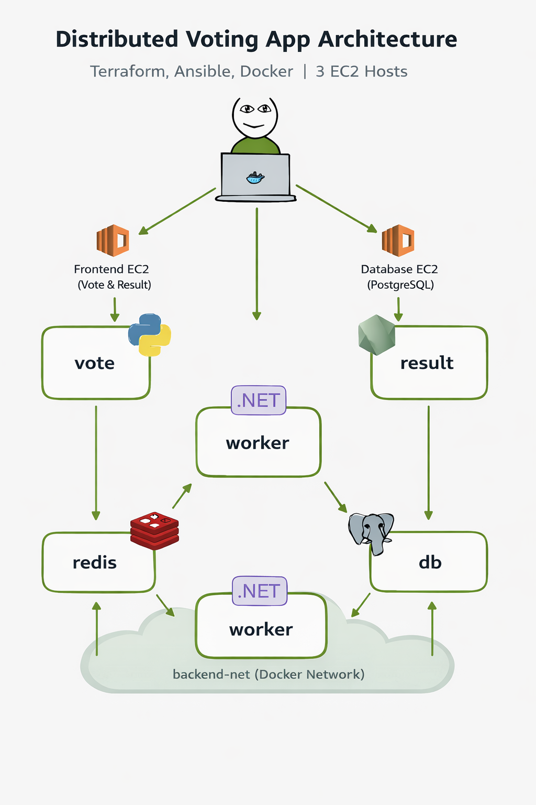

---

# 🚀 Multi-Stack DevOps Infrastructure Automation

End-to-end Infrastructure as Code project deploying a distributed microservices voting application across AWS using Terraform and Ansible.

This project demonstrates:

* Infrastructure provisioning with Terraform
* Multi-host configuration management with Ansible
* Container orchestration using Docker
* Distributed system networking across EC2 instances
* Idempotent automation and production-style deployment

---

# 📦 Project Overview

This project deploys a distributed voting application composed of five services:

* **Vote** – Python/Flask web app (user submits votes)
* **Redis** – In-memory queue
* **Worker** – .NET service processing votes
* **PostgreSQL** – Persistent database
* **Result** – Web app displaying aggregated results

The application is deployed across **three EC2 instances** to simulate a real production-style tiered architecture:

| Host         | Services       |
| ------------ | -------------- |
| Frontend EC2 | Vote + Result  |
| Backend EC2  | Redis + Worker |
| Database EC2 | PostgreSQL     |

This separation enforces isolation, improves fault boundaries, and models real-world distributed infrastructure instead of a single-node demo.

---

# 🏗 Architecture

## System Flow

```
User
  ↓
Vote (Frontend EC2)
  ↓
Redis (Backend EC2)
  ↓
Worker (.NET)
  ↓
Postgres (DB EC2)
  ↓
Result (Frontend EC2)
```

Vote → Redis → Worker → Postgres → Result

---

## 🖼 Architecture Diagram




---

# 🔄 Data & Traffic Flow

1. User submits a vote via the Vote UI.
2. Vote service pushes the vote into Redis.
3. Worker consumes votes from Redis.
4. Worker writes processed votes into PostgreSQL.
5. Result service queries PostgreSQL and displays aggregated totals.

### Key Architectural Decisions

* Private IP communication between EC2 instances
* Explicit hostname resolution using `/etc/hosts` for cross-host containers
* Readiness checks for Redis and Postgres before dependent services start
* Idempotent infrastructure and configuration automation
* Separation of infrastructure (Terraform) and configuration (Ansible)

---

# 🧰 Tech Stack

| Layer             | Tool           | Purpose                            |
| ----------------- | -------------- | ---------------------------------- |
| Infrastructure    | Terraform      | Provision AWS EC2 + networking     |
| Configuration     | Ansible        | Install Docker + deploy containers |
| Containerization  | Docker         | Package application services       |
| Local Development | Docker Compose | Run full stack locally             |
| Cloud Platform    | AWS EC2        | Compute infrastructure             |

---

# 📋 Prerequisites

Before running the project:

* AWS CLI configured
* Terraform installed
* Ansible installed
* SSH key created and added to EC2
* Security groups configured:

| Port | Purpose              |
| ---- | -------------------- |
| 22   | SSH                  |
| 80   | Vote UI              |
| 81   | Result UI            |
| 6379 | Redis (private)      |
| 5432 | PostgreSQL (private) |

---

# ▶️ How to Run (Full Deployment Pipeline)

## Step A – Provision Infrastructure

```
terraform init
terraform plan
terraform apply
```

Terraform provisions:

* 3 EC2 instances
* Networking
* Security groups
* Outputs public and private IPs

---

## Step B – Generate Ansible Inventory

Use Terraform outputs to generate your `inventory.ini`:

```
terraform output
```

Populate:

```
[frontend]
<frontend-public-ip>

[backend]
<backend-private-ip>

[db]
<db-private-ip>

[all:vars]
ansible_user=ubuntu
```

---

## Step C – Deploy Application

```
ansible-playbook -i inventory.ini docker.yml
```

Ansible will:

* Install Docker
* Start containerd + docker
* Deploy Postgres
* Deploy Redis + Worker
* Deploy Vote + Result
* Perform readiness checks
* Run smoke tests

---

## Step D – Verify Deployment

Open:

Vote UI:

```
http://<frontend-public-ip>
```

Result UI:

```
http://<frontend-public-ip>:81
```

Expected behavior:

* Vote UI loads
* Result UI loads
* Votes update in real time
* Worker logs show successful DB writes

---

# 🛠 Troubleshooting (Real Issues Encountered)

This project involved real distributed system debugging.

## 1. Hostname Resolution Failure

Containers expected hostname `db`, but Docker DNS does not work across EC2 hosts.

Fix:
Used Ansible `etc_hosts` to map:

```
db → <db_private_ip>
```

---

## 2. Redis Not Reachable

Worker attempted connection to `127.0.0.1`.

Fix:

* Created Docker network on backend
* Set `REDIS_HOST=redis`
* Published Redis port

---

## 3. Docker Socket Activation (Ubuntu 24.04)

Systemd socket conflicts prevented Docker startup.

Fix:

* Ensured containerd running
* Ensured docker enabled and active
* Removed stale socket state

---

## 4. Database Schema Conflict

Manual schema creation caused:

```
operator does not exist: integer = text
```

Fix:
Removed manual schema init and allowed .NET Worker to manage schema lifecycle.

---

## 5. Private IP / SSH Confusion

Private IPs unreachable externally.

Fix:

* Public IP only on frontend
* Private IP communication internally between backend + db

---

# 📚 What I Learned

This project reinforced:

* Infrastructure as Code principles with Terraform
* Multi-host configuration management using Ansible
* Container networking across distributed systems
* Idempotent automation design
* Debugging Docker daemon issues on modern Linux
* Cloud networking using public vs private IPs
* Service readiness and dependency management
* How distributed systems fail in subtle ways

The most important lesson:
Distributed systems fail quietly and unexpectedly. Structured debugging beats guesswork every time.

---

# 📁 Recommended Repository Structure

```
Multi-Stack-DevOps-Infrastructure/
│
├── terraform/
│   ├── main.tf
│   ├── variables.tf
│   ├── outputs.tf
│
├── ansible/
│   ├── inventory.ini
│   ├── docker.yml
│
├── docker-compose.yml
├── README.md
└── docs/
    └── architecture-diagram.png
```

---


